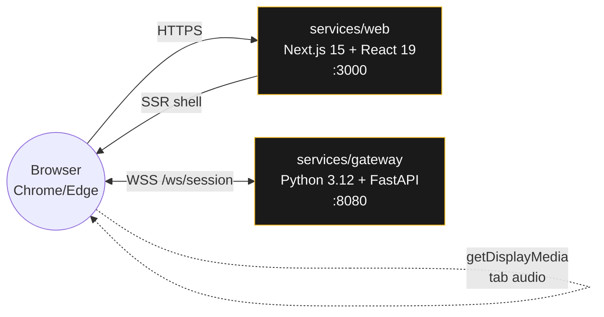

# Sales Copilot

**Live coaching for sales calls.** A browser captures a meeting tab, streams it to a Python gateway over WebSocket, and renders coaching suggestions into an editorial-terminal UI in real time.

[](https://github.com/inSideos-designs/sales-copilot/actions/workflows/ci.yml)
[](LICENSE)
[](docs/superpowers/plans/2026-04-07-phase-1-skeleton.md)

> **Phase 1 status:** end-to-end skeleton with *canned* coaching suggestions. No real STT, no real LLM, no auth. This phase proves the capture + WebSocket pipeline. See the [roadmap](#roadmap) for what's next.

## Live demo

**Web UI:** <https://sales-copilot-web-360277569038.us-central1.run.app>
**Gateway health:** <https://sales-copilot-gateway-360277569038.us-central1.run.app/health>

Open the web URL in Chrome or Edge, share any tab with **"Share tab audio"** checked, and watch canned suggestions stream in every ~2 seconds. Both services auto-scale to zero — expect a ~5 second cold start on the first click.

## What it looks like

```
 Sales Copilot                               SESS _abc123   status: ● ACTIVE
 ────────────────────────────────────────────────────
 LIVE COACHING · PHASE 1 · CANNED SUGGESTION STREAM

 [ ■ End Session ]                                        3 signals

 ↓ COACHING FEED                          sentiment / intent / suggestion
 ──────────────────────────────────────────────────────────────────────
 ┃ T+05.2 · DISCOVERY                                       sentiment +0
 ┃ Ask what metrics they use to measure success today.
 ──────────────────────────────────────────────────────────────────────
 ┃ T+10.4 · QUALIFY BUDGET                                  sentiment +1
 ┃ Confirm budget range before showing pricing.
 ──────────────────────────────────────────────────────────────────────
 ┃ T+15.6 · HANDLE OBJECTION                                sentiment -1
 ┃ Acknowledge the concern, then share a relevant customer story.
```

Each card has a 4px vertical **sentiment spine** on the left that flashes amber on arrival, then settles to its sentiment color. Typography pairs Instrument Serif (display) + JetBrains Mono (metadata) + IBM Plex Sans (body) on a warm near-black background with a subtle SVG grain overlay.

## Architecture



**Boundaries:**

- `services/gateway` knows nothing about the browser or HTTP UI. It only speaks WebSocket on `/ws/session` and serves `/health`.
- `services/web` knows nothing about STT, LLMs, or Python. It only speaks to the gateway's WebSocket.
- `protocol.py` (Python) and `protocol.ts` (TypeScript) are intentional mirrors — if one changes, the other must.
- `session.py` owns per-connection state, `suggestions.py` is a pure async generator with no WebSocket knowledge, and `main.py` wires them together.

## Tech stack

| Layer | Choice |
| --- | --- |
| **Web framework** | Next.js 15 (App Router), React 19, TypeScript |
| **Styling** | Tailwind CSS v4, shadcn/ui, editorial-terminal theme |
| **Fonts** | Instrument Serif, JetBrains Mono, IBM Plex Sans (via `next/font`) |
| **Gateway** | Python 3.12, FastAPI, uvicorn, asyncio |
| **Protocol** | JSON over WebSocket, typed discriminated unions on both sides |
| **Testing** | pytest + pytest-asyncio (gateway), vitest + Testing Library (web) |
| **Lint** | ruff (Python), ESLint (TypeScript) |
| **Containers** | Docker, docker-compose |
| **CI** | GitHub Actions (pytest, ruff, vitest, lint, Next.js build) |
| **Deploy** | Google Cloud Run (us-central1), Artifact Registry, Cloud Build |

## Quick start

You need Docker + Docker Compose. That's it.

```bash
git clone https://github.com/inSideos-designs/sales-copilot.git
cd sales-copilot
docker compose up --build
```

- Web UI → <http://localhost:3000>
- Gateway health → <http://localhost:8080/health>

To run the manual smoke test:

1. Open <http://localhost:3000> in Chrome or Edge.
2. Open any second tab (e.g. `https://example.com`) so you have something to share.
3. Click **Start Session** → pick the second tab → **check "Share tab audio"** → click Share.
4. Status flips `connecting` → `active` and a suggestion card appears within ~5 seconds. More arrive every 5s.
5. Click **End Session** to tear down cleanly.

**Knobs worth knowing:**

- `SUGGESTION_TICK_SECONDS=1.0 docker compose up` → snappy 1-second demo tick
- `LOG_LEVEL=debug docker compose up` → verbose gateway logs

## Project structure

```
sales-copilot/
├── services/
│   ├── gateway/                          # Python 3.12 + FastAPI
│   │   ├── src/sales_copilot_gateway/
│   │   │   ├── main.py                   # ASGI app, /health, /ws/session
│   │   │   ├── protocol.py               # Typed message contract
│   │   │   ├── session.py                # Per-connection state + lifecycle
│   │   │   └── suggestions.py            # Async canned suggestion generator
│   │   ├── tests/                        # 20 pytest tests
│   │   ├── pyproject.toml                # uv-managed
│   │   └── Dockerfile
│   └── web/                              # Next.js 15 + React 19 + TS
│       ├── src/
│       │   ├── app/
│       │   │   ├── layout.tsx            # Fonts + dark theme
│       │   │   ├── page.tsx              # HomePage state machine
│       │   │   └── globals.css           # Tailwind v4 + editorial theme
│       │   ├── components/
│       │   │   ├── SessionPanel.tsx      # The UI
│       │   │   └── ui/                   # shadcn primitives
│       │   └── lib/
│       │       ├── protocol.ts           # TS mirror of protocol.py
│       │       ├── audioCapture.ts       # getDisplayMedia wrapper
│       │       └── wsClient.ts           # SessionWebSocket wrapper
│       ├── cloudbuild.yaml               # Bakes NEXT_PUBLIC_GATEWAY_WS_URL
│       └── Dockerfile                    # Next.js standalone output
├── docker-compose.yml
├── .github/workflows/ci.yml              # pytest + ruff + vitest + lint + build
└── docs/superpowers/
    ├── specs/2026-04-07-sales-copilot-design.md    # Architecture spec
    └── plans/2026-04-07-phase-1-skeleton.md        # Phase 1 task plan
```

## Development

### Gateway (Python)

Requires [`uv`](https://docs.astral.sh/uv/) for dependency management.

```bash
cd services/gateway
uv sync                                                    # install deps
uv run pytest -v                                           # 20 tests
uv run ruff check .                                        # lint
uv run uvicorn sales_copilot_gateway.main:app --reload --port 8080
```

Env vars:

| Variable | Default | Purpose |
| --- | --- | --- |
| `LOG_LEVEL` | `INFO` | Root logging level |
| `SUGGESTION_TICK_SECONDS` | `5.0` | Seconds between canned suggestions |

### Web (Next.js)

Requires Node 22+.

```bash
cd services/web
npm install
npm run dev                                                # hot-reload on :3000
npm test                                                   # 16 vitest tests
npm run lint
npm run build                                              # production build
```

Env vars:

| Variable | Default | Purpose |
| --- | --- | --- |
| `NEXT_PUBLIC_GATEWAY_WS_URL` | `ws://localhost:8080/ws/session` | Baked at **build time** — see [`services/web/Dockerfile`](services/web/Dockerfile) |

> **Note:** `NEXT_PUBLIC_*` variables are inlined into the client bundle at build time by Next.js, not read at runtime. For Cloud Run deploys, we pass the gateway's `wss://` URL as a Docker build-arg via [`services/web/cloudbuild.yaml`](services/web/cloudbuild.yaml).

## Deploying to Cloud Run

The live demo is deployed to Google Cloud Run in `us-central1`. The rough sequence (see [`services/web/cloudbuild.yaml`](services/web/cloudbuild.yaml) for the exact web build args):

```bash
# 1. Build + push the gateway image
cd services/gateway
gcloud builds submit --tag us-central1-docker.pkg.dev/PROJECT_ID/sales-copilot/gateway:latest

# 2. Deploy the gateway (remember --timeout=3600 so WebSockets aren't killed at 60s)
gcloud run deploy sales-copilot-gateway \
  --image=us-central1-docker.pkg.dev/PROJECT_ID/sales-copilot/gateway:latest \
  --region=us-central1 --port=8080 --allow-unauthenticated \
  --timeout=3600 --set-env-vars=SUGGESTION_TICK_SECONDS=2.0

# 3. Capture the gateway URL and build the web image with it baked in
GATEWAY_WSS="wss://sales-copilot-gateway-PROJECT_NUM.us-central1.run.app/ws/session"
cd ../web
gcloud builds submit --config=cloudbuild.yaml \
  --substitutions="_GATEWAY_WS_URL=$GATEWAY_WSS,_TAG=latest"

# 4. Deploy the web
gcloud run deploy sales-copilot-web \
  --image=us-central1-docker.pkg.dev/PROJECT_ID/sales-copilot/web:latest \
  --region=us-central1 --port=3000 --allow-unauthenticated
```

Both services scale to zero between requests and sit comfortably in the Cloud Run free tier for a demo.

## Roadmap

| Phase | Scope | Status |
| --- | --- | --- |
| **Phase 1** | Skeleton end-to-end, canned suggestions, Cloud Run deploy | ✅ Shipped |
| **Phase 2** | Identity Platform auth, short-lived signed WS tokens | Planned |
| **Phase 3** | Real Chirp 2 Speech-to-Text with diarization, Opus frame upload | Planned |
| **Phase 4** | Real Gemini 2.5 Flash suggestions with context caching | Planned |
| **Phase 5** | Firestore + GCS persistence with 30-day lifecycle | Planned |
| **Phase 6** | Production observability, failure handling, SLOs | Planned |

Each phase gets its own plan document in [`docs/superpowers/plans/`](docs/superpowers/plans/). The full architecture spec lives in [`docs/superpowers/specs/2026-04-07-sales-copilot-design.md`](docs/superpowers/specs/2026-04-07-sales-copilot-design.md) and includes the per-call unit economics (~$0.48 for a 15-minute call) and the migration path to self-hosted Whisper past ~1,500 calls/month.

## License

[MIT](LICENSE) © 2026 inSideos-designs
